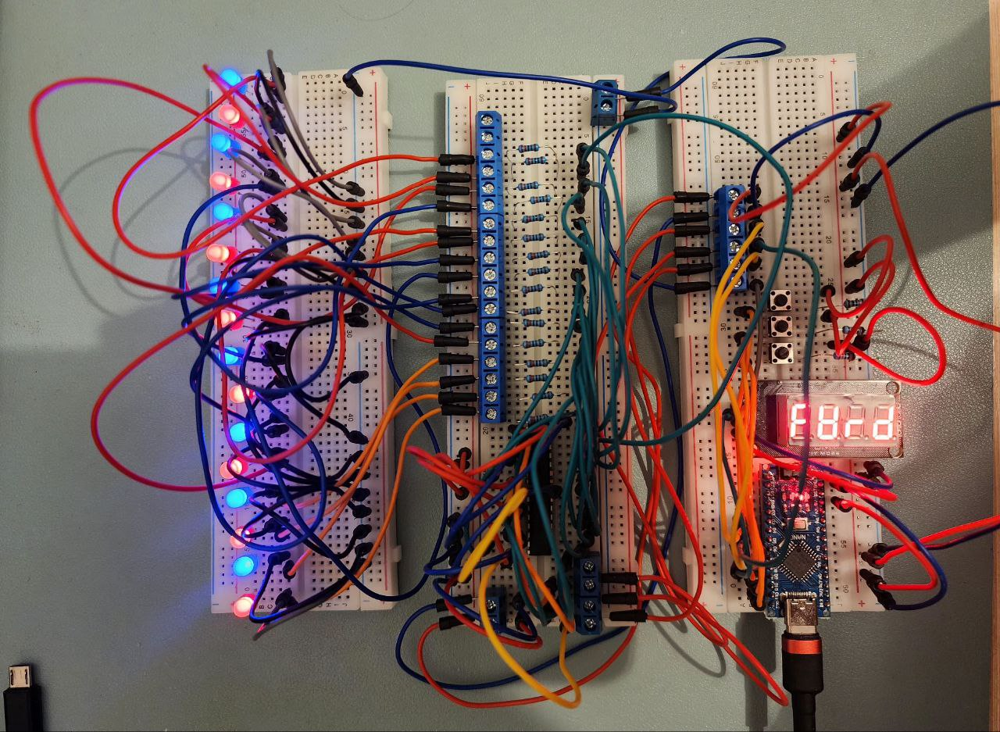

# Eye Trainer

## Description

This is a simple eye trainer which is supposed to reduce muscle stress after focusing on same distance for a long time. The constraction is long stick (1.0-1.5m) with LEDs placed along. LEDs turn on with choosen order after selected switch time is passed. Display helps to control the device.

## Controls

**Buttons:**

1. Main
2. Up
3. Down

## Usage

Device starts in "run" mode. but inactive. Click "Up" button to start with default settings. Click "Down" button to pause. Click "Main" button to switch displayed info. On other screens than "run" press "Up" or "Down" buttons to change settings.

On "Test" screen any button except "Main" will trigger test sequence to check display and LEDs.

## Device Settings

**LEDS order modes (rnod):**

1. Forward (FrWd)
2. Backward (bAC-)
3. Ping-Pong (PInG)
4. Random (rnd) (default)

**Brightness (brgh):**
    
Number from 25 to 255.

**Switch Time (time):**

Number between 25 and 1500 measured in milliseconds x10, i.e. 25 means 250 ms and 1500 means 15000 ms (15 seconds).
Default value 300 (3 seconds).

**Time mode (tmod):**

1. Constant (CnSt)
2. Manusl (nAnL)
3. Decremental (dECr) (not implemented)

## Components Used
1. Arduino Nano (ATMega328PB) x1
2. ShiftRegister 74HC595N x2
3. LED x16
4. Resistor 220Ohm x16
5. Resistor 10kOhm x3
6. Segment Display TM1637 x1
7. Tact Button x3
8. Solderless breadboards x3
9. Wires (a lot)

## Connection Scheme

To be added. Hints are in file EyeTrainerLayout.diy (can be opened with DIY Layout Creator).

### Text description

**Arduino's BreadBoard:**

1. Contains Arduino Nano, TM1637 Display, 3 tact buttons with 10kOhm resistors, connectors
2. Pins D7, D8 controlls display (see Defines.h)
3. Pins D9, D10, D11 receives buttons signals (see Defines.h)
4. Pins D3, D4, D5 controlls shift registers (see Defines.h)
5. Ping 6 controlls brightness of LEDs (see Defines.h)
6. D6, D3, D4, D5, GND and 5V pins are passed to ShiftRegisters' BreadBoard

**ShiftRegisters' BreadBoard:**

1. Contains two 74HC595N shift registers, x16 220Ohm resistors and connectors
2. Pins Q0..Q7 of both shift registers are used to controll LEDs.
3. Two 74HC595N are connected sequentially. Latch, Data and Clock connections to Arduino board are defined in Defines.h

**IMPORTANT: Arduino's pins are different in EyeTrainer project!**

Source: https://blog.timodenk.com/shift-register-arduino-library/

## General View

## Notes

Python script (LogDistanceCalc.ipynb, Jupyter Notebook) can be used to define distances between LEDs on stick.

## Known Problems

1. Sometimes buttons click are not registered or skipped.

## Possible Improvements

1. Lighten small printed and high contrast images with white LEDs. Probably it would be easier and healthier to focus eyes on, than watching LEDs directly.
